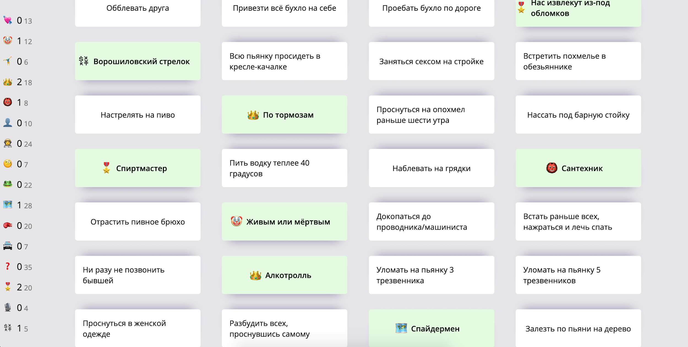
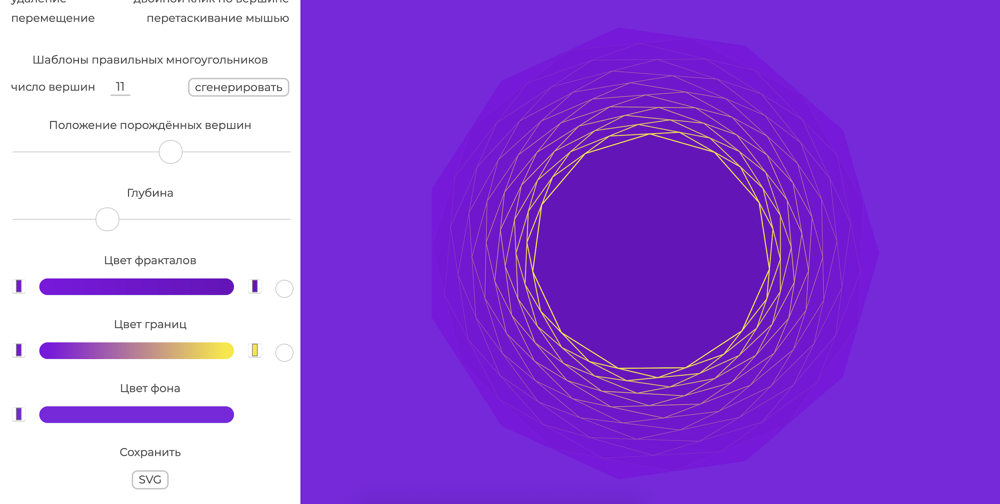
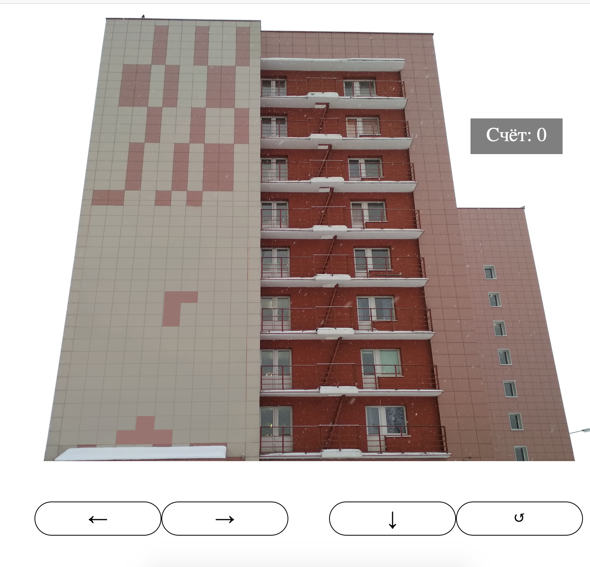
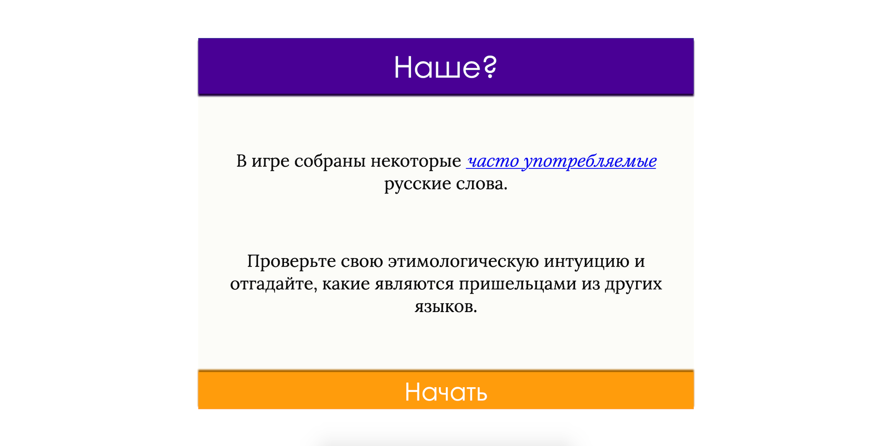

# stepanzh.github.io
The latest works are listed first.
You also can find my design stuff in [instagram ☂️](https://instagram.com/stepanzh_design/).

## 🌶️ 10PRINT [[LINK]](https://stepanzh.github.io/10PRINT/) 📱 🖥️
Generative art experiments around 10PRINT maze generator.

## Алко ачивки [[LINK]](https://stepanzh.github.io/alco_achievements/) 📱 🖥️ 🇷🇺
Список "достижений", которые могут быть получены в нетрезвом виде.
Оригинал принадлежит [Анонимусу](https://2ch.hk).

## 🌶️ Фракталы (Fractals) [[LINK]](https://stepanzh.github.io/fractals/) 📵 🖥️
Редактор фракталов на основе многоугольников. Ценящим геометрию. Созданный Вами фрактал можно будет сохранить!

Polygon-based fractal editor. For "geometrical" aesthets. Generated fractals can be saved!

## 🌶️ OKTIS [[LINK]](https://stepanzh.github.io/oktis/) 📱 🖥️
Тетрис на здании :)

A joke variation of Tetris. This version is on the wall of a real cell-textured wall of a building. SPACE for rotating figures, arrows for moving.

## 🌶️ TEA MATTERS! [[LINK]](https://stepanzh.github.io/tea-matters/) 📱 🖥️
JS + CSS animation. Rotation of stars is disabled (need optimization).

## HSL ANIMATED GRID [[LINK]](https://stepanzh.github.io/hsl-grid/) 📵 🖥️
A ractangle grid containing circles, which move toward to mouse and change color. Plane js.

## 🌶️ НАШЕ? (NASHE?) [[LINK]](https://stepanzh.github.io/etymology/) 📱 🖥️ 🇷🇺
Познавательная игра. Вам предоставляются карточки с русскими словами. Задача - отгадать, какие из слов заимствованные, а какие нет. По результатам игры вы получите звание.

Nashe? (Is this our?) is an educational game. A gamer guesses if a given Russian word native or adopted. At the end, the gamer is granted with a title.

## PURE-CSS [[LINK]](https://stepanzh.github.io/pure-css/) 📱 🖥️
Some works around styling elements and achieving ui/ux effects.

## AKIRA PROJECT [[LINK]](https://stepanzh.github.io/akira/) 📵 🖥️
The first quite serious my work in frontend. AKIRA PROJECT interactively tells plot of Akira anime.
